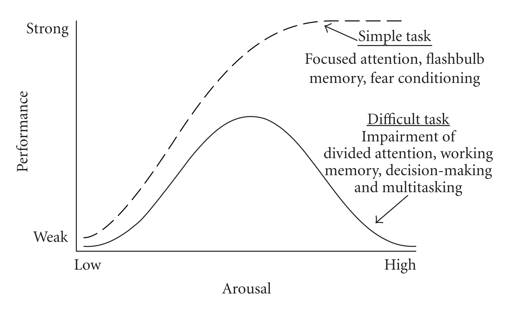

# Stimulant Noise

 

### Purpose
The program provides sounds (noise, music, other) which should load your attention. For example, if you can't focus on something because it's too easy, or you are trying to start, and it didn't get interesting/challenging yet.

Unlike most white/brown/nature noise generators, it comes with an easy way to adjust noise level on the fly. That way you don't have to switch to and from a website every time you want to focus harder or not. Or change playlist. Or whatever you were doing so far.

It is meant as a generic performance booster, but it can be especially useful to manage any attention-related issues, like ADHD.

## Usage

### Running the program
#### If you don't know what you're doing:

1. Top right corner of this page, click green button <>Code and download ZIP
2. Run StimulantNoise.

If your system screams about it logging your keyboard, that's because it does. You have to let it do so, it's a core function. Program is open sourced in part in order to assure you of it's safety.

Keep in mind, if you're running StimulantNoise.exe, presets and default sounds are located in dist/StimulantNoise folder.

#### If you know what you're doing
StimulantNoise.py would be the file you want to start with, and you can delete build and dist folders.

#### If you kind of know what you're doing, but you're not on Windows
1. Top right corner of this page, click green button <>Code and download ZIP
2. Open the folder in terminal
3. Run `python3 -m pip install --user virtualenv`
4. Run `python3 -m venv env`
5. Run `source env/bin/activate`
6. Run `pip install -r requirements.txt`
7. Run `python StimulantNoise.py`

### Adjusting noise level

Program comes with some presets, organized into groups of 3. That way you can maintain a general vibe, while adjusting noise level.

You'll want to set up hotkeys, so you can adjust noise level on the fly.

#### Adjusting sounds

You can change which sounds are played and with what volume in each preset. You can also add new sounds via 'add sounds' button. It's recommended to add them to 'sounds' folder and to use .ogg format, but it should roughly work regardless.

Alternatively, you can edit json files in 'presets' folder* manually in any text editor. They are fairly friendly if you want to make some bigger changes.

*If you're using .exe version, presets are stored in dist/StimulantNoise/presets.

### Help

#### Program doesn't start

If you haven't made any changes, just download it again.

#### Nope, still something's wrong

Open an issue and tell me all about it.

### Tips

If you need novelty in your background sound, I recommend the least demanding playlist and running this program on top of it.

If you're used to having podcasts in the background, you can do the same thing, but consider having podcast much lauder than noise - distinguishing words is pretty attention-heavy and noise makes it extra hard, so a quiet podcast may be a much higher load than a loud one.

#### Extended lore

[Yerkes–Dodson law](https://en.wikipedia.org/wiki/Yerkes%E2%80%93Dodson_law) is one of better replicating and established pieces of research in cognitive psychology.

Much has been written about [Flow](https://en.wikipedia.org/wiki/Flow_(psychology)) and [Deep work](https://en.wikipedia.org/wiki/Deep_work). Tl;DR is, you should maintain top of that performance hill as much as possible. If work gets too hard, lower additional load (noise, distractions, etc.) to maintain performance. If work gets too easy, increase additional load to maintain performance.

Some tasks, like writing code or reading academic papers have quite strongly varying difficulty during a single session. All popular noise generators I was able to find ask you to pick a setting and go back to the program every time you want to change it, same for playlists. That's perfectly fine for tinnitus, falling asleep, cutting one off from the world or performing tasks of constant difficulty, but there are whole classes of tasks where you want to be able to adjust noise level on the fly.

So I made the thing.
